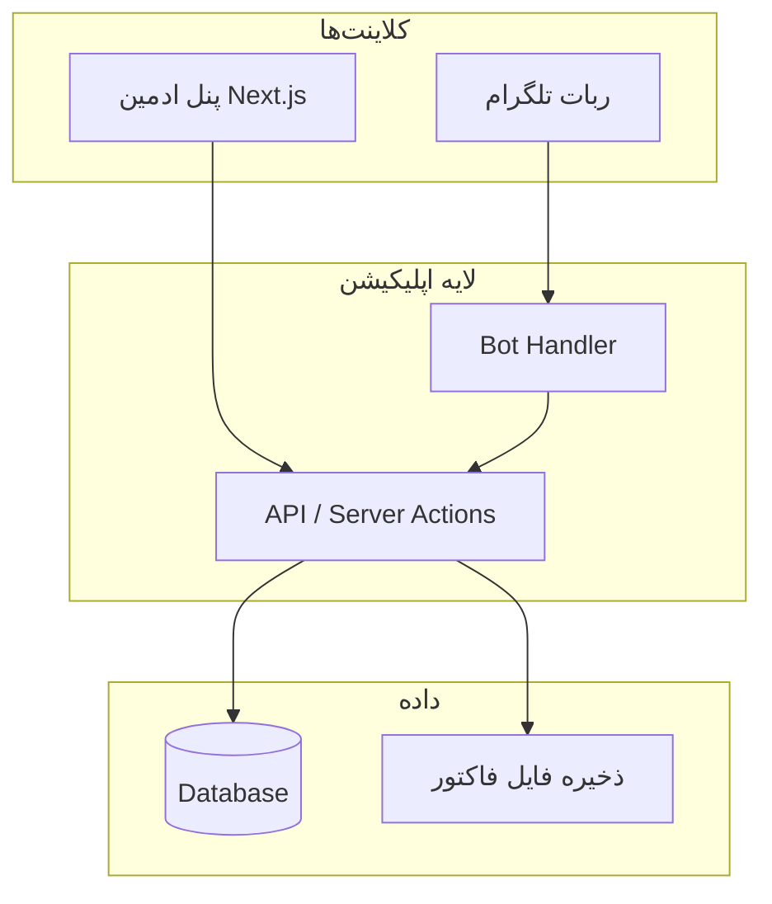
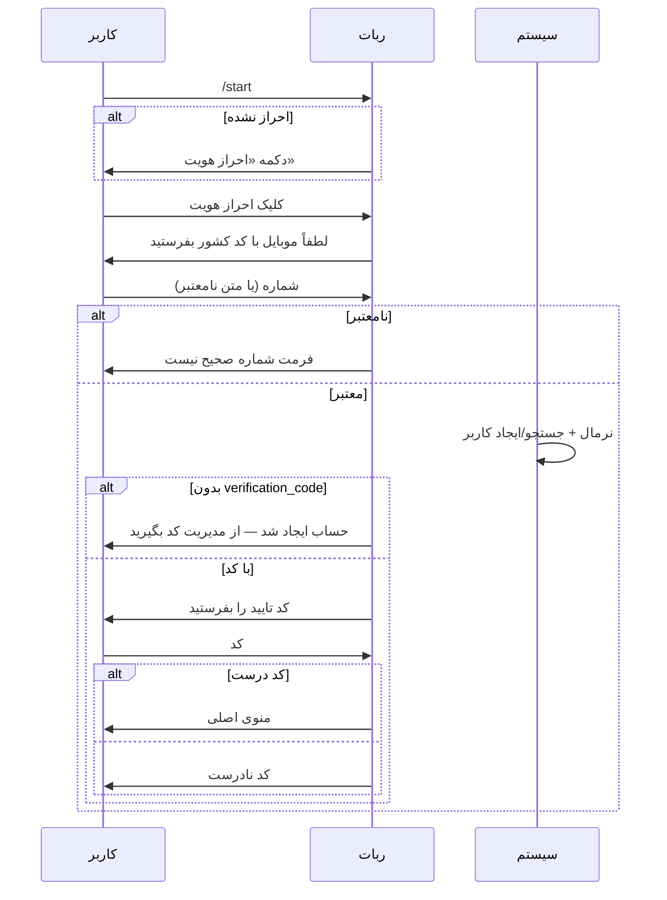

# PRD — سیستم تبدیل ارز با ربات تلگرام و پنل مدیریت

| فیلد | مقدار |
|------|--------|
| نام پروژه | Taymaz Market (پیشنهادی) |
| نسخه سند | 1.0 |
| تاریخ | ۱۴۰۵/۰۳/۱۴ (۲۰۲۶-۰۶-۰۴) |
| وضعیت | پیش‌طراحی — Mock / MVP |
| مخاطب سند | تیم توسعه، طراح UI، مدیر محصول |

---

## ۱. خلاصه اجرایی

این محصول یک **پلتفرم تبدیل ارز** است که مشتریان از طریق **ربات تلگرام** درخواست تبدیل ثبت می‌کنند و مدیران از طریق **پنل وب مدیریت** کاربران، ارزها، درخواست‌ها و لاگ‌ها را کنترل می‌کنند.

جریان اصلی: مشتری احراز هویت می‌شود → درخواست تبدیل (مبدا/مقصد/مبلغ/حساب بانکی/فاکتور) ثبت می‌کند → مدیر بررسی و تایید/رد می‌کند → ربات نتیجه را به مشتری اطلاع می‌دهد.

**هدف فاز فعلی:** طراحی و پیاده‌سازی **Mock** با React، Next.js، Tailwind CSS، ShadCN UI برای پنل ادمین؛ و ربات تلگرام با کتابخانه حرفه‌ای (پیشنهاد: grammY یا Telegraf) با داده‌های شبیه‌سازی‌شده یا API مشترک.

---

## ۲. اهداف و موفقیت

### ۲.۱ اهداف کسب‌وکار

- ثبت و پیگیری درخواست‌های تبدیل ارز بدون تماس تلفنی مستقیم.
- کنترل دسترسی مشتریان با **کد تایید** صادرشده توسط مدیر.
- شفافیت وضعیت درخواست (در انتظار / تایید / رد) با **کد پیگیری یکتا**.
- ثبت کامل فعالیت‌ها در **لاگ سیستم** برای حسابرسی.

### ۲.۲ معیارهای موفقیت (MVP / Mock)

| معیار | توضیح |
|--------|--------|
| احراز هویت ربات | ورود با موبایل + کد تایید؛ کاربر بدون کد مسدود از منو |
| ثبت درخواست | جریان کامل از انتخاب ارز تا آپلود فاکتور |
| پنل ادمین | CRUD کاربران، ارزها، مدیران؛ تایید/رد درخواست‌های جدید |
| UX پنل | ظاهر حرفه‌ای، واکنش‌گرا، فیلتر پیشرفته، شبیه پنل‌های enterprise |
| لاگ | ثبت عملیات مدیر و کاربر در ربات |

### ۲.۳ خارج از محدوده (فاز Mock — پیشنهادی)

- اتصال واقعی به درگاه بانکی / واریز خودکار
- محاسبه نرخ لحظه‌ای ارز (نرخ می‌تواند ثابت یا دستی باشد)
- اعلان push خارج از تلگرام
- چندزبانه بودن پنل (فارسی اولویت)
- نقش‌های چندگانه مدیر (فقط یک سطح مدیر در MVP)

---

## ۳. ذینفعان و پرسونا

| پرسونا | نقش | نیاز اصلی |
|--------|-----|-----------|
| **مدیر سیستم** | صاحب کسب‌وکار / اپراتور | مدیریت کاربران، بررسی درخواست‌ها، تنظیم ارزها، مشاهده لاگ |
| **مشتری (کاربر ربات)** | کاربر تلگرام | ثبت درخواست تبدیل، پیگیری تاریخچه، دریافت نتیجه |
| **توسعه‌دهنده** | پیاده‌سازی | API یکپارچه، env برای توکن ربات، استاندارد موبایل |

---

## ۴. معماری سطح بالا



### ۴.۱ مسیرهای URL پنل (الزام صریح)

| مسیر | صفحه |
|------|------|
| `/login` | ورود مدیر (موبایل + رمز) |
| `/` | داشبورد اصلی (پس از احراز هویت) |
| `/admins` | مدیریت مدیران |
| `/users` | مدیریت کاربران (+ زیربخش فعال/غیرفعال) |
| `/requests/new` | درخواست‌های جدید (در انتظار تایید) |
| `/requests/history` | تاریخچه (تایید شده + رد شده) |
| `/settings/currencies` | ارزهای فعال |
| `/settings/logs` | لاگ‌های سیستم |

> در فاز Mock می‌توان از **App Router** در Next.js با layout ادمین (sidebar + header) استفاده کرد.

### ۴.۲ پشته فنی پیشنهادی

| لایه | تکنولوژی |
|------|-----------|
| پنل | Next.js 14+ (App Router), React, TypeScript |
| UI | Tailwind CSS, ShadCN UI, Lucide icons |
| ربات | grammY یا Telegraf (Node.js) |
| دیتابیس (production) | PostgreSQL + Prisma/Drizzle |
| Mock | JSON / MSW / in-memory store |
| فایل | آپلود محلی یا S3-compatible |
| Env | `TELEGRAM_BOT_TOKEN`, `DATABASE_URL`, `SESSION_SECRET` |

---

## ۵. موجودیت‌ها و مدل داده

### ۵.۱ Admin (مدیر)

| فیلد | نوع | الزام | توضیح |
|------|-----|--------|--------|
| id | UUID / int | بله | کلید اصلی |
| name | string | بله | نام نمایشی |
| mobile | string | بله | با کد کشور، یکتا |
| password_hash | string | بله | رمز ورود (هش‌شده) |
| created_at | datetime | بله | |
| updated_at | datetime | بله | |

**ورود:** موبایل + رمز → session/JWT.

---

### ۵.۲ User (کاربر سیستم / مشتری ربات)

| فیلد | نوع | الزام | توضیح |
|------|-----|--------|--------|
| id | UUID / int | بله | |
| name | string | خیر* | از تلگرام یا مدیر |
| telegram_chat_id | string | خیر | پس از استارت ربات |
| telegram_username | string | خیر | @username بدون @ |
| mobile | string | بله** | فرمت یکتا: `989125553344` |
| profile_image_url | string | خیر | آواتار تلگرام یا آپلود |
| verification_code | string | خیر | null = غیرفعال |
| notes | text | خیر | توضیحات مدیر |
| is_authenticated | boolean | محاسباتی | کد معتبر + تطابق در جلسه ربات |
| created_at | datetime | بله | |
| updated_at | datetime | بله | |

\* پس از استارت بدون مدیر، name از تلگرام پر می‌شود.  
\** پس از اولین ارسال موبایل در ربات اجباری می‌شود.

**دسته‌بندی نمایشی در پنل:**

- **فعال:** `verification_code IS NOT NULL`
- **غیرفعال:** `verification_code IS NULL` (معمولاً ثبت‌شده توسط ربات)

---

### ۵.۳ UserBankAccount (حساب‌های ذخیره‌شده per ارز مقصد)

| فیلد | نوع | توضیح |
|------|-----|--------|
| id | UUID | |
| user_id | FK | |
| currency_id | FK | ارز **مقصد** (طبق توضیحات: مثلاً لیر به‌عنوان مبدا — در PRD ذخیره بر اساس **ارز مقصد** درخواست) |
| account_number | string | کارت / شبا / حساب — نرمال‌سازی |
| label | string | اختیاری — «کارت اصلی» |
| created_at | datetime | |

> **قانون:** پس از تایید «بله» در ربات، شماره با `currency_id` مقصد ذخیره شود. در درخواست بعدی لیست همین ترکیب نمایش داده شود؛ تکراری ذخیره نشود.

---

### ۵.۴ Currency (ارز)

| فیلد | نوع | الزام | توضیح |
|------|-----|--------|--------|
| id | UUID | بله | |
| title | string | بله | مثلاً «ریال» |
| slug | string | بله | انگلیسی یکتا: `rials` |
| country_code | string | بله | مثلاً `IR` — از لیست ثابت کشورها |
| is_active | boolean | بله | فقط فعال در ربات |
| sort_order | int | خیر | ترتیب نمایش |
| created_at | datetime | بله | |

---

### ۵.۵ ExchangeRequest (درخواست تبدیل)

| فیلد | نوع | الزام | توضیح |
|------|-----|--------|--------|
| id | UUID | بله | کلید داخلی |
| tracking_code | string | بله | **یکتا**، قابل نمایش به کاربر — مثلاً `12345678` |
| user_id | FK | بله | |
| source_currency_id | FK | بله | ارز مبدا |
| target_currency_id | FK | بله | ارز مقصد |
| amount | decimal | بله | مبلغ تبدیل (عدد انگلیسی در DB) |
| bank_account | string | بله | شماره نهایی تاییدشده |
| invoice_image_url | string | بله | فاکتور/فیش |
| status | enum | بله | `pending` \| `approved` \| `rejected` |
| rejection_reason | text | خیر | اجباری هنگام رد |
| reviewed_by | FK Admin | خیر | |
| reviewed_at | datetime | خیر | |
| created_at | datetime | بله | |
| updated_at | datetime | بله | |

**وضعیت‌ها:**

| وضعیت | معنی | نمایش در پنل |
|--------|------|----------------|
| `pending` | در انتظار تایید | درخواست‌های جدید |
| `approved` | تایید شده | تاریخچه |
| `rejected` | رد شده | تاریخچه |

**تولید tracking_code:** الگوریتم یکتا (مثلاً ۸ رقم عددی با بررسی برخورد یا prefix + random).

---

### ۵.۶ SystemLog (لاگ)

| فیلد | نوع | توضیح |
|------|-----|--------|
| id | UUID | |
| actor_type | enum | `admin` \| `user` \| `system` |
| actor_id | string | شناسه مدیر یا کاربر |
| action | string | مثلاً `user.create`, `request.approve` |
| entity_type | string | `User`, `ExchangeRequest`, ... |
| entity_id | string | |
| metadata | JSON | جزئیات (IP، payload خلاصه) |
| created_at | datetime | |

**رویدادهای اجباری لاگ:**

- ورود/خروج مدیر
- CRUD کاربر، مدیر، ارز
- تایید/رد درخواست
- استارت ربات، احراز هویت موفق/ناموفق
- ثبت درخواست، ارسال فاکتور
- به‌روزرسانی telegram_chat_id / username / name

---

### ۵.۷ Country (لیست مرجع)

لیست ثابت در کد یا جدول مرجع: `code`, `name_fa`, `name_en`, `phone_prefix`.

---

## ۶. قوانین کسب‌وکار

### ۶.۱ نرمال‌سازی شماره موبایل

1. تبدیل ارقام فارسی/عربی به انگلیسی: `۰-۹` → `0-9`.
2. حذف فاصله، خط تیره، `+` ابتدایی.
3. ذخیره **همیشه** با کد کشور بدون `+` (مثال ایران: `989123456789`).
4. اعتبارسنجی طول و پیش‌شماره بر اساس کشور (حداقل برای ایران: `98` + ۱۰ رقم).

### ۶.۲ احراز هویت کاربر

| شرط | رفتار |
|------|--------|
| موبایل در DB نیست | ایجاد کاربر جدید بدون `verification_code` → پیام «حساب ایجاد شد، از مدیریت کد بگیرید» → پایان فلو |
| موبایل هست، کد خالی | پس از موبایل، درخواست کد → عدم تطابق → پیام خطا |
| موبایل هست، کد درست | احراز هویت → نمایش منوی اصلی |
| موبایل هست | به‌روزرسانی `telegram_chat_id`, `telegram_username`, `name` در صورت تغییر |

### ۶.۳ ثبت درخواست

- ارز مبدا ≠ ارز مقصد (اعتبارسنجی).
- مبلغ: عدد مثبت؛ تبدیل ارقام فارسی به انگلیسی.
- فاکتور: فقط `photo` یا `document` تصویری.
- پس از ثبت: وضعیت `pending` + ارسال `tracking_code` به کاربر.

### ۶.۴ تایید/رد توسط مدیر

- **تایید:** `status = approved`، حذف از لیست «جدید»، اعلان ربات.
- **رد:** `rejection_reason` اجباری، `status = rejected`، اعلان ربات با دلیل و کد پیگیری.

---

## ۷. پنل مدیریت — نیازمندی‌های تفصیلی

### ۷.۱ اصول UX/UI

- Layout حرفه‌ای: **Sidebar** ثابت، **Header** با پروفایل مدیر، breadcrumb.
- تم: روشن/تاریک (اختیاری در Mock)، فونت فارسی خوانا (Vazirmatn / IRANSans).
- جدول‌ها: pagination، sort، **فیلتر پیشرفته** (drawer یا popover).
- فرم‌ها: validation سمت کلاینت + سرور، toast برای بازخورد.
- Empty state و skeleton loading.
- الهام از پنل‌های Metronic: کارت آمار داشبورد، badge وضعیت رنگی، آیکن‌های واضح.

### ۷.۲ داشبورد (`/`)

ویجت‌های پیشنهادی (Mock):

- تعداد درخواست‌های در انتظار
- درخواست‌های امروز
- کاربران فعال / غیرفعال
- نمودار ساده وضعیت درخواست‌ها (اختیاری)

### ۷.۳ بخش مدیران (`/admins`)

| قابلیت | جزئیات |
|--------|---------|
| لیست | جدول با جستجو |
| ایجاد | نام، موبایل، رمز |
| ویرایش | نام، موبایل، تغییر رمز |
| حذف | تأیید modal — جلوگیری از حذف خودِ کاربر لاگین‌شده |

### ۷.۴ بخش کاربران (`/users`)

**زیرناوبری:** تب یا فیلتر «فعال» / «غیرفعال» / «همه».

| قابلیت | جزئیات |
|--------|---------|
| لیست | ستون‌ها: نام، موبایل، یوزرنیم، chat_id، وضعیت کد، تاریخ |
| فیلتر پیشرفته | موبایل، نام، دارای/بدون کد، تاریخ ثبت، chat_id |
| ایجاد | نام، موبایل، کد تایید، توضیحات — chat_id و username اختیاری/خالی |
| ویرایش | همه فیلدها + تولید/تغییر کد تایید |
| حذف | soft delete پیشنهادی در production |

### ۷.۵ درخواست‌های جدید (`/requests/new`)

- فقط `status = pending`.
- نمایش: کاربر (لینک به پروفایل)، ارز مبدا → مقصد، مبلغ، پیش‌نمایش فاکتور (lightbox)، تاریخ.
- عملیات: **تایید** (یک کلیک + confirm)، **رد** (modal + textarea دلیل اجباری).

### ۷.۶ تاریخچه درخواست‌ها (`/requests/history`)

- فیلتر: وضعیت (approved/rejected)، بازه تاریخ، کاربر، tracking_code، ارز، مبلغ.
- فقط خواندنی؛ نمایش دلیل رد برای rejected.

### ۷.۷ تنظیمات — ارزها (`/settings/currencies`)

- CRUD: عنوان، slug (latin)، کشور (select).
- فعال/غیرفعال — غیرفعال در ربات نمایش داده نشود.

### ۷.۸ تنظیمات — لاگ‌ها (`/settings/logs`)

- جدول با فیلتر: تاریخ از–تا، actor_type، کاربر/مدیر، action، entity.
- جزئیات در drawer (metadata JSON فرمت‌شده).

### ۷.۹ ورود (`/login`)

- فیلد موبایل (با راهنمای فرمت بین‌المللی).
- رمز عبور.
- خطای عمومی امن («اطلاعات نادرست»).
- Redirect به `/` پس از موفقیت.

---

## ۸. ربات تلگرام — نیازمندی‌های تفصیلی

### ۸.۱ کتابخانه و ساختار

- **پیشنهاد:** [grammY](https://grammy.dev) — middleware، session، conversations.
- **جایگزین:** Telegraf.
- توکن: `process.env.TELEGRAM_BOT_TOKEN`.
- Webhook (production) یا long polling (توسعه).

### ۸.۲ حالت‌های مکالمه (State Machine)

```
IDLE
  → AUTH_PHONE
  → AUTH_CODE
  → MAIN_MENU
  → NEW_REQUEST_SOURCE
  → NEW_REQUEST_TARGET
  → NEW_REQUEST_AMOUNT
  → NEW_REQUEST_BANK (input | pick_list)
  → NEW_REQUEST_BANK_CONFIRM
  → NEW_REQUEST_INVOICE
  → HISTORY_LIST (page N)
  → HISTORY_DETAIL
```

هر حالت باید **دکمه بازگشت** داشته باشد (یک مرحله عقب)، به‌جز پس از ثبت نهایی درخواست.

### ۸.۳ فلو: استارت و احراز هویت



**پیام‌های نمونه (با emoji):**

- خوش‌آمد: «👋 به ربات تبدیل ارز خوش آمدید!»
- خطای فرمت: «⚠️ فرمت شماره صحیح نیست. لطفاً موبایل را با کد کشور ارسال کنید (مثال: `989123456789`).»
- حساب جدید: «✅ حساب شما در سیستم ایجاد شد. برای دریافت کد تایید با مدیریت تماس بگیرید، سپس مجدداً «احراز هویت» را بزنید.»

### ۸.۴ منوی اصلی (پس از احراز هویت)

| دکمه | عمل |
|------|-----|
| 📝 ثبت درخواست جدید | شروع فلو تبدیل |
| 📋 تاریخچه درخواست‌ها | لیست ۵تایی + «بیشتر» |

### ۸.۵ فلو: ثبت درخواست جدید

1. **ارز مبدا:** Inline keyboard از ارزهای فعال — برچسب: `{title} – {country}` + بازگشت.
2. **ارز مقصد:** همان لیست (فیلتر: غیربرابر با مبدا) + بازگشت.
3. **مبلغ:** ورود متن — اعتبار عدد — تبدیل فارسی→انگلیسی — خطا: «مقدار را به صورت عدد وارد کنید».
4. **حساب بانکی:**
   - اگر حساب ذخیره‌شده برای `target_currency` وجود دارد: نمایش دکمه‌های هر حساب + «وارد کردن جدید» + بازگشت.
   - ورود دستی → پیام تأیید: «آیا شماره `…` قابل تأیید است؟» [بله] [خیر].
   - بله → ذخیره در `UserBankAccount` (اگر تکراری نبود).
5. **فاکتور:** فقط تصویر — خطا در غیر این صورت.
6. **ثبت:** ایجاد `ExchangeRequest` + `tracking_code` → «🎉 درخواست شما با شماره پیگیری `{code}` ثبت شد و در انتظار تأیید مدیریت است. پاسخ از همین ربات ارسال می‌شود.»

> **تصحیح نسبت به متن اولیه:** پس از انتخاب ارز مبدا، مرحله بعد **ارز مقصد** است (در توضیحات یک بار «ارز مبدا» تکرار شده بود).

### ۸.۶ فلو: تاریخچه

- مرتب‌سازی: `created_at DESC`.
- صفحه‌بندی: ۵ مورد + دکمه «▶️ بیشتر».
- برچسب هر دکمه: `{source} → {target} – {amount}`.
- کلیک: پیام جزئیات (کد، وضعیت، تاریخ، حساب، دلیل رد در صورت وجود) + بازنمایش لیست.

### ۸.۷ اعلان‌های سیستمی به کاربر

| رویداد | پیام نمونه |
|--------|------------|
| تایید | «✅ درخواست شما به کد `{tracking_code}` تأیید و انجام شد.» |
| رد | «❌ درخواست شما به کد `{tracking_code}` به دلیل: `{reason}` توسط مدیریت رد شد. لطفاً درخواست جدید ثبت کنید.» |

---

## ۹. API / قرارداد داخلی (پیشنهاد Mock)

گروه endpoint یا Server Actions برای استفاده مشترک ربات و پنل:

| عملیات | توضیح |
|--------|--------|
| `POST /api/auth/admin/login` | ورود مدیر |
| `CRUD /api/users` | کاربران |
| `CRUD /api/admins` | مدیران |
| `CRUD /api/currencies` | ارزها |
| `GET/PATCH /api/requests` | لیست، تایید، رد |
| `POST /api/requests` (bot) | ثبت از ربات |
| `GET /api/logs` | لاگ با فیلتر |
| `GET/POST /api/users/:id/bank-accounts` | حساب‌های ذخیره‌شده |

ربات می‌تواند همان لایه را از طریق HTTP داخلی یا import مستقیم service در monorepo صدا بزند.

---

## ۱۰. امنیت و حریم خصوصی

| موضوع | الزام |
|--------|--------|
| رمز مدیر | bcrypt/argon2 |
| Session | httpOnly cookie یا JWT کوتاه‌عمر |
| توکن ربات | فقط env، هرگز در repo |
| فاکتور | دسترسی فقط مدیر + صاحب درخواست (از طریق ربات) |
| Rate limit | روی login و احراز هویت ربات |
| لاگ | عدم ذخیره رمز یا کد تایید کامل در metadata |

---

## ۱۱. نیازمندی‌های غیرعملکردی

| دسته | هدف |
|------|------|
| Performance | پاسخ ربات < ۲ ثانیه در Mock |
| Availability | — |
| i18n | UI پنل RTL فارسی؛ پیام ربات فارسی |
| Accessibility | کنتراست کافی، label در فرم‌ها |
| Mobile | پنل واکنش‌گرا برای تبلیل/موبایل مدیر |

---

## ۱۲. داده Mock پیشنهادی

- ۲ مدیر
- ۱۰ کاربر (۵ فعال، ۵ غیرفعال)
- ۴ ارز: ریال، لیر، دلار، یورو
- ۱۵ درخواست در وضعیت‌های مختلف
- ۵۰ لاگ نمونه

---

## ۱۳. فازبندی پیاده‌سازی

### فاز ۱ — اسکلت و PRD ✅
- سند PRD (همین فایل)
- Init Next + ShadCN + Tailwind
- Layout ادمین + login mock

### فاز ۲ — پنل ادمین Mock
- صفحات CRUD با داده mock
- فیلترها و جدول‌ها
- تایید/رد درخواست

### فاز ۳ — ربات
- grammY + session
- فلوهای کامل با API mock
- اعلان تایید/رد (simulate از پنل)

### فاز ۴ — یکپارچه‌سازی (اختیاری)
- DB واقعی
- Webhook تلگرام
- آپلود فایل

---

## ۱۴. ریسک‌ها و ابهام‌ها

| # | موضوع | تصمیم پیشنهادی |
|---|--------|----------------|
| 1 | تکرار «انتخاب ارز مبدا» در متن | مرحله دوم = **مقصد** |
| 2 | ذخیره حساب بر اساس مبدا یا مقصد | بر اساس **ارز مقصد** (واریز به مقصد) — در صورت نیاز قابل تغییر |
| 3 | طول tracking_code | ۸ رقم عددی |
| 4 | نرخ تبدیل | خارج از scope؛ فقط ثبت مبلغ ورودی |
| 5 | کاربر با کد اشتباه چندبار | محدودیت تلاش (مثلاً ۵ بار) در production |

---

## ۱۵. ضمیمه — چک‌لیست پذیرش

### پنل
- [ ] ورود در `/login` و redirect به `/`
- [ ] CRUD مدیران، کاربران (فعال/غیرفعال)، ارزها
- [ ] لیست درخواست جدید + تایید/رد با دلیل
- [ ] تاریخچه با فیلتر پیشرفته
- [ ] لاگ با فیلتر
- [ ] UI حرفه‌ای RTL

### ربات
- [ ] احراز هویت موبایل + کد
- [ ] نرمال‌سازی اعداد فارسی
- [ ] ثبت درخواست کامل + بازگشت مرحله‌ای
- [ ] تأیید حساب بانکی + ذخیره/انتخاب از لیست
- [ ] تاریخچه صفحه‌بندی ۵تایی
- [ ] پیام‌های emoji‌دار
- [ ] توکن در env

---

## ۱۶. واژه‌نامه

| اصطلاح | تعریف |
|--------|--------|
| کد تایید | رمز یکبار یا ثابت که مدیر به مشتری می‌دهد — در DB ذخیره |
| کد پیگیری | `tracking_code` یکتای درخواست برای مشتری و مدیر |
| کاربر فعال | دارای `verification_code` |
| فاکتور | تصویر فیش واریز |

---

*این سند بر اساس توضیحات ارائه‌شده توسط ذینفع محصول و استانداردهای رایج سیستم‌های مشابه تهیه شده و مبنای طراحی Mock و MVP قرار می‌گیرد.*
